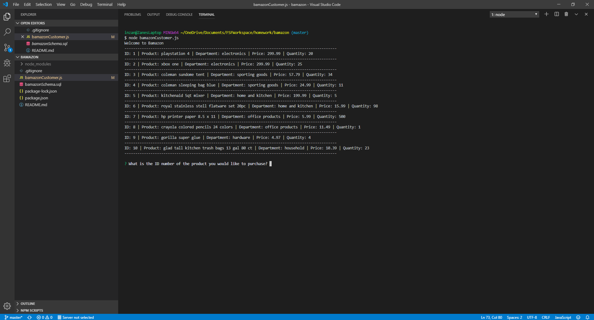
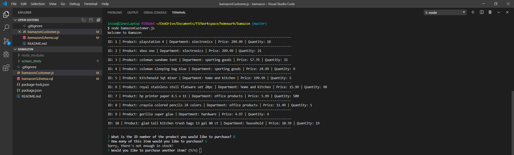
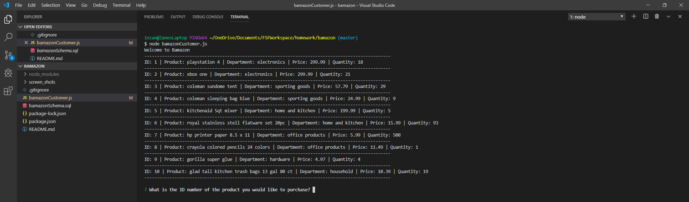

# Bamazon

Bamazon is an Amazon-like storefront that utilizes MySQL, JavaScript and node.js. Bamazon will take in orders from customers and deplete the stock from the store's inventory database. If they choose a product and the quanitity they select is not in inventory they will be prompted that the quantity is insufficient and the option to choose another product.

## NPM Dependencies
* Inquirer
* MySQL

## How to use Bamazon

**node bamazonCustomer.js**
This command will launch into the bamazonCustomer.js file and present the user with the details of the products to choose from. They will then be asked what ID number of the product they would like to purchase.

They will then be asked how many of the item would they like to purchase and if that amount is in stock the order will be placed and they will receive confirmation.

If the amount of the item they chose is not in stock, they will receive a message that "There's not enough in stock" and then be prompted to see if they would like to purchase another item.

Each new customer can see the updated stock as well.

